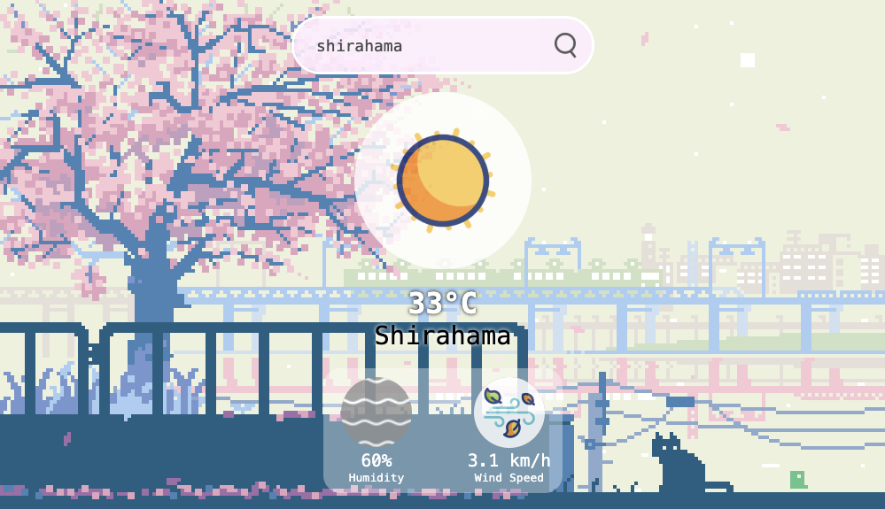
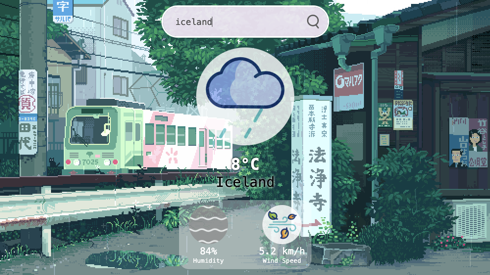
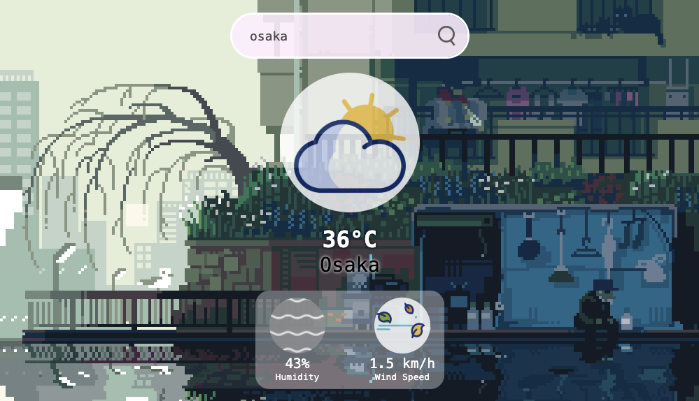

# Retro API Weather App

A retro-styled weather app that uses API to fetch a city and display its current weather.




## How to view without installing

- Click the link in the description to view in browser

## Installation

```
- Download ZIP and open in IDE
```

or

```
git clone https://github.com/marceosayo/Retro-API-Weather-App
```



